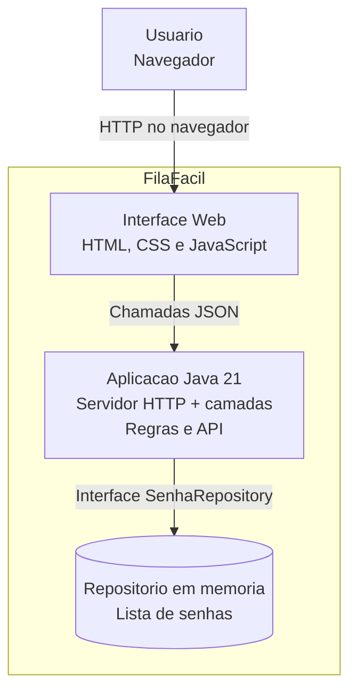

# C4 - Nivel 2: Container

Este diagrama mostra as partes que compoem o sistema por dentro.

## Explicacao

### Interface Web

Paginas HTML com CSS e JavaScript, servidas pela propria aplicacao. Fazem chamadas
para a API e nao tem regra de negocio.

### Aplicacao Java

Um unico programa que contem as camadas model, repository, service e web. Recebe
as requisicoes, aplica as regras e responde em JSON.

### Repositorio em memoria

Guarda as senhas durante a execucao. Como usamos a interface `SenhaRepository`,
poderia ser trocado por um banco de dados no futuro.
