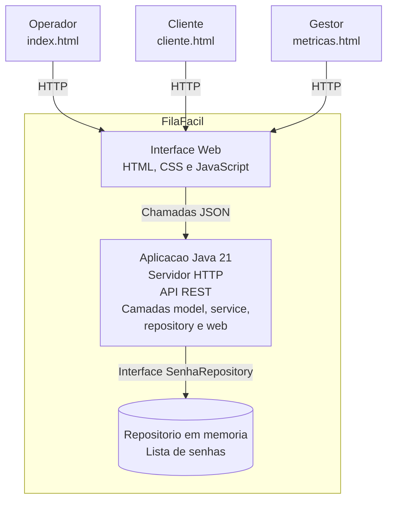

# C4 - Nivel 2: Container

Este diagrama mostra os principais containers que compoem o FilaFacil e como eles se comunicam internamente.

## Explicacao

### Interface Web

A interface do sistema e composta por tres paginas independentes:

- **index.html**: Painel do Operador, utilizado para gerenciar o atendimento das senhas;
- **cliente.html**: Visao do Cliente, destinada aos monitores da sala de espera;
- **metricas.html**: Painel de Metricas, utilizado para acompanhamento gerencial.

Todas as interfaces utilizam HTML, CSS e JavaScript e consomem a mesma API REST disponibilizada pela aplicacao Java, sem possuir regras de negocio.

### Aplicacao Java

Um unico programa desenvolvido em Java 21 que concentra as camadas **model**, **service**, **repository** e **web**. E responsavel por receber as requisicoes HTTP, aplicar as regras de negocio, gerenciar os estados das senhas, emitir eventos do sistema e responder em formato JSON.

### Repositorio em memoria

Armazena as senhas durante a execucao da aplicacao por meio da interface `SenhaRepository`. Essa abstracao permite substituir futuramente a persistencia em memoria por um banco de dados sem alterar as regras de negocio ou a camada de servicos.