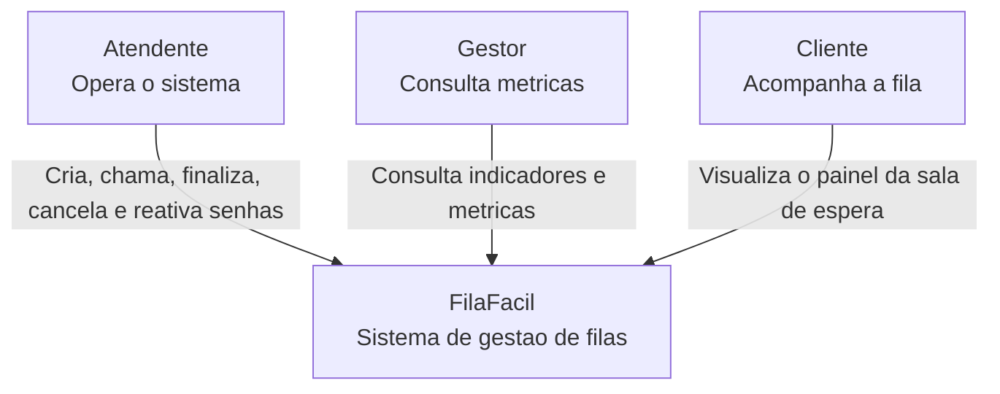

# C4 - Nivel 1: Contexto

Este diagrama mostra o FilaFacil como uma unica caixa e os principais atores que interagem com o sistema.

## Explicacao

O FilaFacil gerencia todo o ciclo de vida de uma senha, desde a sua criacao ate
a finalizacao, cancelamento ou reativacao.

O atendente utiliza o Painel do Operador para realizar as operacoes de atendimento.
O gestor acompanha o desempenho do sistema por meio do Painel de Metricas,
consultando indicadores como tempo medio de espera, tempo medio de atendimento,
taxa de cancelamento e distribuicao por servico. O cliente acompanha sua senha
em tempo real utilizando a Visao do Cliente exibida na sala de espera.

## Fora do escopo

- login e controle de acesso;
- banco de dados;
- envio real de e-mail ou SMS;
- varias unidades de atendimento ao mesmo tempo.