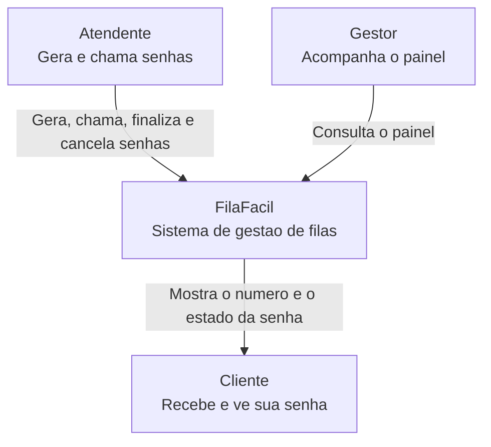

# C4 - Nivel 1: Contexto

Este diagrama mostra o FilaFacil como uma unica caixa e quem interage com ele.

## Explicacao

O FilaFacil cuida de todo o ciclo de uma senha: da criacao ate a finalizacao ou
o cancelamento. O atendente opera o sistema, o gestor acompanha os numeros e o
cliente ve a sua senha ser chamada.

## Fora do escopo

- login e controle de acesso;
- banco de dados;
- envio real de e-mail ou SMS;
- varias unidades de atendimento ao mesmo tempo.
