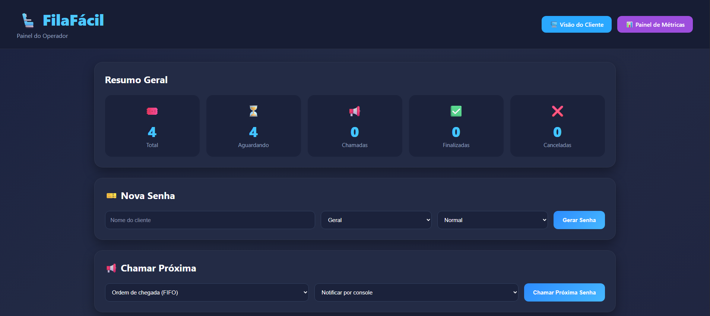
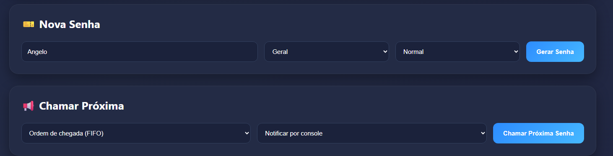
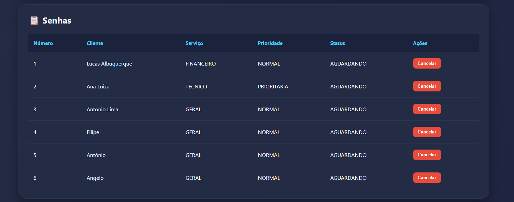
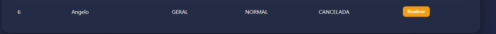
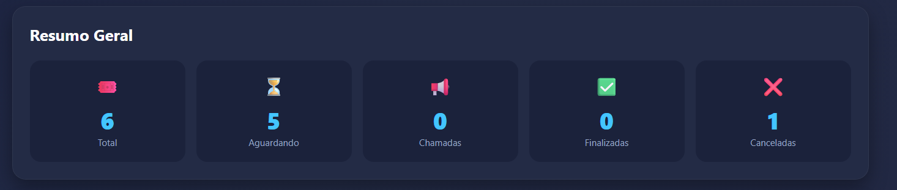
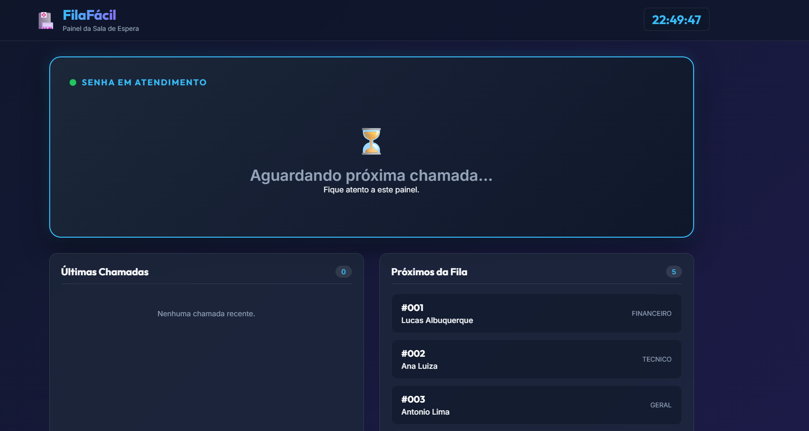
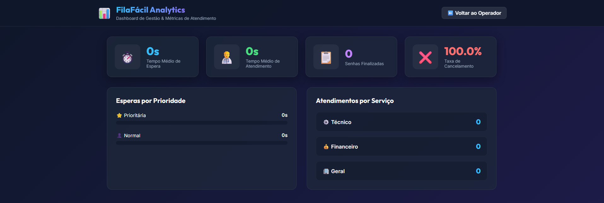

# Documento de Defesa — FilaFácil

**Disciplina:** Arquitetura de Software
**Projeto:** FilaFácil — Sistema de Gestão de Filas de Atendimento
**Tipo de material explicativo:** Opção B (Documento de defesa)

---

## 1. Visão geral do projeto

O **FilaFácil** é um sistema para organizar filas de atendimento (como as de bancos, cartórios ou clínicas). Ele permite gerar senhas, escolher a próxima senha a ser chamada segundo uma política, acompanhar o estado de cada senha e visualizar um painel com os totais.

O sistema foi desenvolvido em **Java 21, sem nenhuma biblioteca externa**. Essa decisão foi tomada de propósito, para que o projeto seja fácil de rodar (basta o JDK) e para que as decisões de arquitetura e os padrões de projeto fiquem visíveis no próprio código, sem serem "escondidos" por um framework.

### 1.1 Funcionalidades

- gerar senhas informando nome, tipo de serviço e prioridade;
- listar as senhas e seus estados;
- chamar a próxima senha por FIFO (ordem de chegada) ou por prioridade;
- finalizar senhas em atendimento;
- cancelar senhas;
- reativar senhas canceladas, retornando-as para a fila de atendimento;
- exibir um painel com o resumo das senhas por status;
- disponibilizar uma Visão do Cliente (Painel da Sala de Espera) com atualização em tempo real;
- disponibilizar um Dashboard de Métricas para acompanhamento operacional;
- registrar eventos no console (auditoria e painel);
- notificar a chamada por console ou por e-mail (simulado).

---

## 2. Arquitetura escolhida

Adotamos a **arquitetura em camadas**. Cada camada tem uma responsabilidade clara e só depende das camadas mais internas. Isso ajuda a manter **alta coesão** (cada parte cuida de uma coisa) e **baixo acoplamento** (as partes se comunicam por interfaces, não por detalhes internos).

| Camada | Pacote | Responsabilidade |
|--------|--------|------------------|
| Apresentação / Web | `web` | Servidor HTTP, API JSON e arquivos da interface |
| Serviço | `service` | Casos de uso; junta as regras do sistema |
| Domínio | `model` | Entidades e regras próprias do negócio |
| Repositório | `repository` | Armazenamento das senhas |
| Padrões | `patterns` | Strategy, Observer e Factory Method |

O sentido das dependências é sempre da camada mais externa para a mais interna:

```
web  →  service  →  model
                 →  repository (via interface)
                 →  patterns
```

A camada `model` não depende de nenhuma outra, o que a torna a parte mais estável do sistema.

Além do Painel do Operador, a camada Web passou a disponibilizar outras duas interfaces:

- **Visão do Cliente**, destinada à exibição das senhas chamadas em monitores ou televisores na sala de espera;
- **Dashboard de Métricas**, destinado ao acompanhamento operacional da fila por gestores, apresentando indicadores e estatísticas em tempo real.

Essas interfaces reutilizam a mesma API HTTP e as mesmas regras de negócio da aplicação, mantendo a arquitetura em camadas e evitando duplicação de código.

### 2.1 Diagramas C4

Os diagramas C4 de Nível 1 (Contexto) e Nível 2 (Container) estão em:

- `docs/architecture/c4-contexto.md`
- `docs/architecture/c4-container.md`

### 2.2 Decisões registradas (ADRs)

As três principais decisões de arquitetura estão documentadas em `docs/adr/`:

- **ADR 001** — por que usamos arquitetura em camadas;
- **ADR 002** — por que os dados ficam em memória;
- **ADR 003** — por que escolhemos Strategy, Observer e Factory Method.

---

## 3. O sistema em funcionamento

As telas abaixo foram capturadas com o sistema em execução localmente, demonstrando as principais funcionalidades implementadas.

### 3.1 Painel do Operador

Ao acessar `http://localhost:8080`, o operador visualiza o painel principal do sistema.

Nele são apresentados os indicadores gerais da fila (total de senhas, aguardando, chamadas, finalizadas e canceladas), além das áreas para geração de novas senhas, chamada da próxima senha e gerenciamento da fila.



---

### 3.2 Geração de uma nova senha

Para cadastrar um atendimento, o operador informa o nome do cliente, seleciona o tipo de serviço e define se a senha será normal ou prioritária.

Após clicar em **Gerar Senha**, a nova senha passa a fazer parte da fila de atendimento.



---

### 3.3 Gerenciamento da fila

A tabela de senhas apresenta todas as senhas cadastradas e seus respectivos estados.

Por meio dela, o operador pode acompanhar a fila e executar ações como cancelamento, finalização e reativação das senhas, de acordo com o estado atual de cada atendimento.



---

### 3.4 Reativação de senhas

Uma das funcionalidades adicionadas ao projeto foi a possibilidade de reativar senhas canceladas.

Quando uma senha é cancelada, ela permanece registrada no sistema. Caso o cliente retorne ou o cancelamento tenha ocorrido por engano, basta clicar em **Reativar** para que a senha volte automaticamente ao estado **AGUARDANDO**, retornando à fila sem necessidade de gerar uma nova senha.

Antes da reativação:



Após a reativação:



Essa funcionalidade preserva o histórico do atendimento e evita a criação de senhas duplicadas.

---

### 3.5 Visão do Cliente

Além do painel do operador, foi desenvolvida uma interface exclusiva para a sala de espera.

Essa tela exibe em tempo real:

- senha atualmente em atendimento;
- últimas senhas chamadas;
- próximas senhas da fila;
- relógio em tempo real;
- atualização automática sem necessidade de recarregar a página.

Sempre que uma nova senha é chamada, o painel é atualizado automaticamente e um alerta sonoro é emitido para chamar a atenção dos clientes.



---

### 3.6 Dashboard de Métricas

Também foi implementado um Dashboard de Métricas destinado ao acompanhamento gerencial da operação.

O painel apresenta indicadores como:

- tempo médio de espera;
- tempo médio de atendimento;
- quantidade de atendimentos por tipo de serviço;
- distribuição entre senhas normais e prioritárias;
- indicadores consolidados do funcionamento da fila.

As informações são atualizadas periodicamente por meio da API da aplicação, permitindo o acompanhamento da operação em tempo real.



---

### 3.7 Saída no console (Observer e Factory Method)

Enquanto o sistema está em execução, o console registra automaticamente os eventos produzidos pela aplicação.

Abaixo está um exemplo de saída:

```text
[AUDITORIA] Evento: CRIADA | Senha: 1 | Status: AGUARDANDO
[AUDITORIA] Evento: CRIADA | Senha: 2 | Status: AGUARDANDO
[AUDITORIA] Evento: CRIADA | Senha: 3 | Status: AGUARDANDO
FilaFacil iniciado em http://localhost:8080
[AUDITORIA] Evento: CRIADA | Senha: 4 | Status: AGUARDANDO
[AUDITORIA] Evento: CHAMADA | Senha: 2 | Status: CHAMADA
[PAINEL] Senha 2 - Carlos Souza, dirija-se ao atendimento.
[EMAIL] Para: Carlos Souza | Assunto: Sua senha foi chamada | Senha 2 chamada para atendimento.
```

Nesse trecho é possível observar o funcionamento do padrão **Observer**, responsável por notificar automaticamente os observadores de auditoria, painel e métricas sempre que ocorre uma mudança de estado em uma senha.

Também é possível identificar a atuação do padrão **Factory Method**, utilizado para instanciar dinamicamente o canal de notificação escolhido (console ou e-mail), desacoplando a criação da notificação de sua utilização pela aplicação.

---

## 4. Padrões de projeto aplicados

Implementamos três padrões de projeto (GoF), cada um resolvendo uma necessidade real do sistema.

---

### 4.1 Strategy — escolha da próxima senha

**Problema:** o sistema precisa chamar a próxima senha utilizando políticas diferentes, podendo atender por ordem de chegada (FIFO) ou priorizando senhas preferenciais.

**Solução:** foi criada a interface `EstrategiaFila`, com implementações independentes (`EstrategiaFifo` e `EstrategiaPrioridade`). O serviço apenas seleciona qual estratégia utilizar, sem conhecer os detalhes de cada algoritmo.

Interface comum (`patterns/strategy/EstrategiaFila.java`):

```java
public interface EstrategiaFila {
    Senha escolherProxima(List<Senha> senhas);
}
```

Implementação da política por prioridade (`patterns/strategy/EstrategiaPrioridade.java`):

```java
public class EstrategiaPrioridade implements EstrategiaFila {

    @Override
    public Senha escolherProxima(List<Senha> senhas) {
        Senha prioritaria = null;
        Senha normal = null;

        for (Senha senha : senhas) {
            if (senha.getStatus() != StatusSenha.AGUARDANDO) {
                continue;
            }

            if (senha.getPrioridade() == Prioridade.PRIORITARIA) {
                if (prioritaria == null || senha.getNumero() < prioritaria.getNumero()) {
                    prioritaria = senha;
                }
            } else {
                if (normal == null || senha.getNumero() < normal.getNumero()) {
                    normal = senha;
                }
            }
        }

        return prioritaria != null ? prioritaria : normal;
    }
}
```

Escolha da estratégia (`SenhaService.java`):

```java
private EstrategiaFila escolherEstrategia(PoliticaFila politica) {
    if (politica == PoliticaFila.PRIORIDADE) {
        return new EstrategiaPrioridade();
    }
    return new EstrategiaFifo();
}
```

**Trade-off:** seria possível implementar toda essa lógica utilizando apenas estruturas condicionais (`if/else`) dentro do serviço. Entretanto, o padrão Strategy torna o código mais organizado e permite adicionar novas políticas sem alterar o restante da aplicação. O custo é um número maior de classes.

---

### 4.2 Observer — reação aos eventos das senhas

**Problema:** sempre que uma senha muda de estado, diferentes partes do sistema precisam reagir de maneira independente. Além da auditoria e do painel de atendimento, o sistema também passou a coletar métricas operacionais.

**Solução:** foi utilizado o padrão **Observer**. O `PublicadorEventos` mantém uma lista de observadores cadastrados e notifica todos eles quando ocorre um evento na aplicação.

Publicador (`patterns/observer/PublicadorEventos.java`):

```java
public class PublicadorEventos {

    private List<ObservadorSenha> observadores = new ArrayList<>();

    public void inscrever(ObservadorSenha observador) {
        observadores.add(observador);
    }

    public void notificar(String tipoEvento, Senha senha) {
        for (ObservadorSenha observador : observadores) {
            observador.aoOcorrerEvento(tipoEvento, senha);
        }
    }
}
```

No serviço basta publicar o evento:

```java
senha.chamar();
repositorio.salvar(senha);
publicador.notificar("CHAMADA", senha);
```

Atualmente existem três observadores registrados:

- **ObservadorAuditoria:** registra os eventos no console;
- **ObservadorPainel:** produz mensagens destinadas ao painel de atendimento;
- **ObservadorMetricas:** coleta estatísticas de tempo médio de espera, tempo médio de atendimento e indicadores utilizados pelo Dashboard de Métricas.

**Trade-off:** sem o Observer, o serviço precisaria conhecer e chamar diretamente cada componente interessado. Com o padrão, novos observadores podem ser adicionados apenas registrando-os no `Main`, mantendo baixo acoplamento. O custo é que o fluxo de execução fica menos explícito.

---

### 4.3 Factory Method — criação das notificações

**Problema:** a aplicação pode notificar o cliente por diferentes canais (console ou e-mail), e novos canais poderão ser adicionados futuramente.

**Solução:** foi utilizado o padrão **Factory Method**. A classe abstrata `CriadorNotificacao` define o método `criarNotificacao()`, enquanto cada subclasse decide qual implementação concreta será utilizada.

Criador abstrato:

```java
public abstract class CriadorNotificacao {

    protected abstract Notificacao criarNotificacao();

    public void notificarChamada(Senha senha) {
        Notificacao notificacao = criarNotificacao();
        String mensagem = "Senha " + senha.getNumero() + " chamada para atendimento.";
        notificacao.enviar(senha, mensagem);
    }
}
```

Implementação para e-mail:

```java
public class CriadorNotificacaoEmail extends CriadorNotificacao {

    @Override
    protected Notificacao criarNotificacao() {
        return new NotificacaoEmail();
    }
}
```

**Trade-off:** seria possível instanciar diretamente cada notificação com `new`. Entretanto, o Factory Method desacopla a criação do objeto de sua utilização, facilitando a inclusão de novos canais de comunicação. O custo é um pequeno aumento na quantidade de classes.

---

## 5. Princípios de projeto respeitados

Durante o desenvolvimento procurou-se seguir princípios clássicos de projeto de software:

- **Alta coesão:** cada classe possui uma responsabilidade bem definida. A entidade `Senha` controla seu próprio estado, `SenhaService` implementa os casos de uso, enquanto a camada web apenas recebe e responde requisições HTTP.

- **Baixo acoplamento:** o serviço depende da interface `SenhaRepository`, permitindo trocar a implementação de armazenamento sem alterar a lógica de negócio.

- **Separação de responsabilidades:** toda regra de negócio permanece nas camadas de domínio e serviço. A interface HTML/JavaScript apenas consome a API REST.

- **Extensibilidade:** os padrões Strategy, Observer e Factory Method permitem adicionar novas políticas de atendimento, novos observadores e novos canais de notificação sem modificar o código existente.

---

## 6. Testes

O projeto possui testes automatizados implementados sem bibliotecas externas na classe `TesteSenhaService`.

Os testes verificam:

1. geração sequencial das senhas;
2. atendimento utilizando FIFO;
3. atendimento utilizando Prioridade;
4. impossibilidade de finalizar uma senha que ainda não foi chamada;
5. cancelamento de senhas;
6. reativação de senhas canceladas;
7. contabilização correta dos indicadores do painel.

Exemplo de saída:

```text
[OK] Numeracao sequencial
[OK] FIFO chama a mais antiga
[OK] Prioridade chama a prioritaria
[OK] Nao finaliza senha que so esta aguardando
[OK] Cancelamento de senha
[OK] Reativacao de senha cancelada
[OK] Painel conta corretamente

Resultado: 7 passou, 0 falhou.
```

---

## 7. Limitações e evoluções futuras

Apesar de atender aos objetivos da disciplina, algumas limitações foram mantidas propositalmente.

- As senhas permanecem armazenadas apenas em memória. Como existe a abstração `SenhaRepository`, uma implementação utilizando banco de dados pode ser adicionada futuramente sem alterar a camada de serviço.

- A notificação por e-mail é simulada, sendo exibida apenas no console. Futuramente poderá ser integrada a um serviço real de envio.

- O Dashboard de Métricas trabalha sobre os dados da execução corrente da aplicação. Persistindo as informações em banco de dados seria possível gerar relatórios históricos e indicadores por período.

- O sistema não implementa autenticação nem controle de acesso, funcionalidades que ficaram fora do escopo deste trabalho.

Essas decisões foram tomadas para manter o foco nos conceitos de Arquitetura de Software, nos padrões de projeto e na organização das responsabilidades entre as camadas da aplicação.