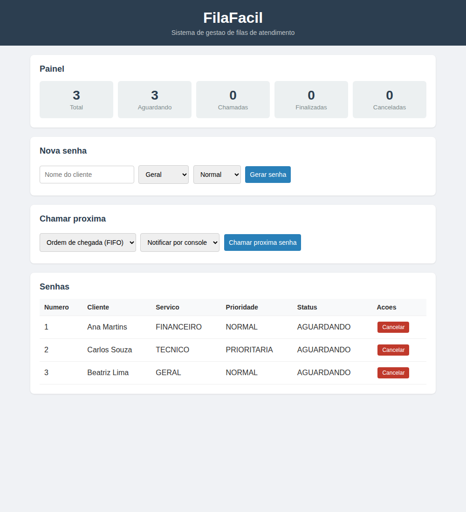
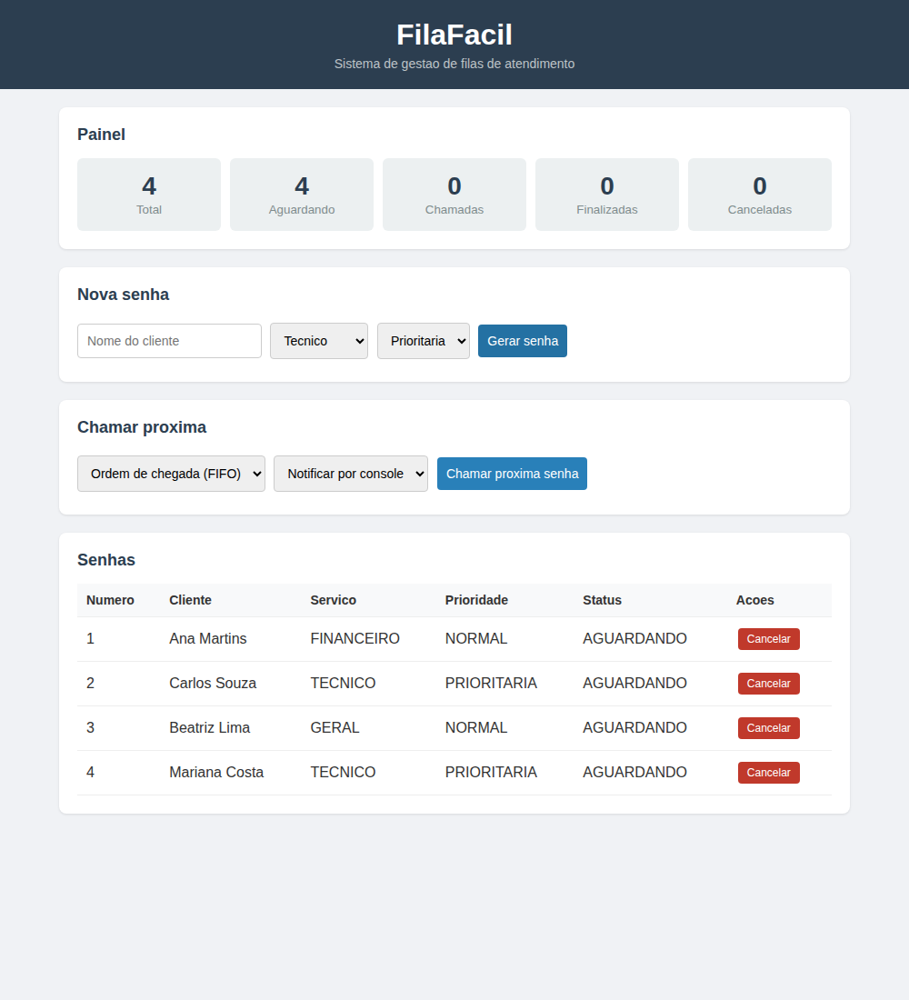
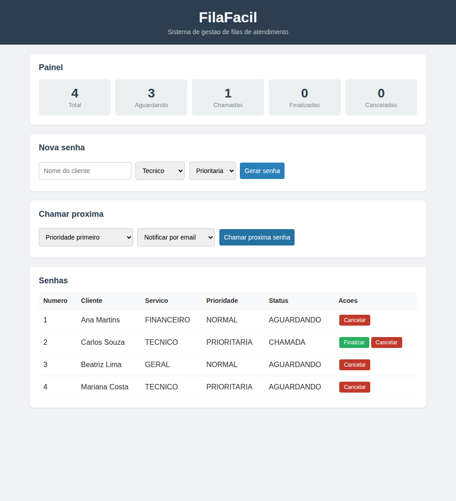

# Documento de Defesa — FilaFácil

**Disciplina:** Arquitetura de Software
**Projeto:** FilaFácil — Sistema de Gestão de Filas de Atendimento
**Tipo de material explicativo:** Opção B (Documento de defesa)

---

## 1. Visão geral do projeto

O **FilaFácil** é um sistema para organizar filas de atendimento (como as de bancos, cartórios ou clínicas). Ele permite gerar senhas, escolher a próxima senha a ser chamada segundo uma política, acompanhar o estado de cada senha e visualizar um painel com os totais.

O sistema foi desenvolvido em **Java 21, sem nenhuma biblioteca externa**. Essa decisão foi tomada de propósito, para que o projeto seja fácil de rodar (basta o JDK) e para que as decisões de arquitetura e os padrões de projeto fiquem visíveis no próprio código, sem serem "escondidos" por um framework.

### 1.1 Funcionalidades

- gerar senhas informando nome, tipo de serviço e prioridade;
- listar as senhas e seus estados;
- chamar a próxima senha por FIFO (ordem de chegada) ou por prioridade;
- finalizar e cancelar senhas;
- exibir um painel com o total de senhas em cada situação;
- registrar os eventos no console (auditoria e painel);
- notificar a chamada por console ou por e-mail (simulado).

---

## 2. Arquitetura escolhida

Adotamos a **arquitetura em camadas**. Cada camada tem uma responsabilidade clara e só depende das camadas mais internas. Isso ajuda a manter **alta coesão** (cada parte cuida de uma coisa) e **baixo acoplamento** (as partes se comunicam por interfaces, não por detalhes internos).

| Camada | Pacote | Responsabilidade |
|--------|--------|------------------|
| Apresentação / Web | `web` | Servidor HTTP, API JSON e arquivos da interface |
| Serviço | `service` | Casos de uso; junta as regras do sistema |
| Domínio | `model` | Entidades e regras próprias do negócio |
| Repositório | `repository` | Armazenamento das senhas |
| Padrões | `patterns` | Strategy, Observer e Factory Method |

O sentido das dependências é sempre da camada mais externa para a mais interna:

```
web  →  service  →  model
                 →  repository (via interface)
                 →  patterns
```

A camada `model` não depende de nenhuma outra, o que a torna a parte mais estável do sistema.

### 2.1 Diagramas C4

Os diagramas C4 de Nível 1 (Contexto) e Nível 2 (Container) estão em:

- `docs/architecture/c4-contexto.md`
- `docs/architecture/c4-container.md`

### 2.2 Decisões registradas (ADRs)

As três principais decisões de arquitetura estão documentadas em `docs/adr/`:

- **ADR 001** — por que usamos arquitetura em camadas;
- **ADR 002** — por que os dados ficam em memória;
- **ADR 003** — por que escolhemos Strategy, Observer e Factory Method.

---

## 3. O sistema em funcionamento

As telas abaixo foram capturadas com o sistema rodando localmente.

### 3.1 Tela inicial

Ao abrir `http://localhost:8080`, o sistema já começa com três senhas de exemplo. O painel mostra os totais e a tabela lista as senhas aguardando.



### 3.2 Gerando uma nova senha

Preenchemos o nome do cliente, escolhemos o tipo de serviço e a prioridade, e clicamos em **Gerar senha**. No exemplo abaixo, foi criada a senha 4 (Mariana Costa, serviço Técnico, prioritária).



### 3.3 Chamando a próxima senha por prioridade

Selecionamos a política **Prioridade primeiro** e o canal **Notificar por e-mail**, e clicamos em **Chamar próxima senha**.

Observe o resultado: mesmo havendo senhas mais antigas aguardando (a senha 1, normal), o sistema chamou a **senha 2 (Carlos Souza, prioritária)**, porque ela é a senha prioritária mais antiga. O painel foi atualizado para 1 chamada e 3 aguardando, e a senha 2 passou a exibir o botão **Finalizar**.



Isso demonstra o padrão **Strategy** funcionando na prática: a política de escolha muda o comportamento do sistema sem alterar o restante do código.

### 3.4 Saída no console (Observer e Factory Method)

Enquanto o sistema roda, o console mostra as mensagens geradas pelos observadores e pela notificação. Este foi o log correspondente às ações acima:

```
[AUDITORIA] Evento: CRIADA | Senha: 1 | Status: AGUARDANDO
[AUDITORIA] Evento: CRIADA | Senha: 2 | Status: AGUARDANDO
[AUDITORIA] Evento: CRIADA | Senha: 3 | Status: AGUARDANDO
FilaFacil iniciado em http://localhost:8080
[AUDITORIA] Evento: CRIADA | Senha: 4 | Status: AGUARDANDO
[AUDITORIA] Evento: CHAMADA | Senha: 2 | Status: CHAMADA
[PAINEL] Senha 2 - Carlos Souza, dirija-se ao atendimento.
[EMAIL] Para: Carlos Souza | Assunto: Sua senha foi chamada | Senha 2 chamada para atendimento.
```

Nesse trecho aparecem os dois observadores (`[AUDITORIA]` e `[PAINEL]`) reagindo aos eventos, e a notificação por e-mail (`[EMAIL]`) criada pelo Factory Method.

---

## 4. Padrões de projeto aplicados

Implementamos três padrões, cada um resolvendo uma necessidade real do sistema.

### 4.1 Strategy — escolha da próxima senha

**Problema:** o sistema precisa chamar a próxima senha de formas diferentes: por ordem de chegada (FIFO) ou dando preferência às senhas prioritárias.

**Solução:** criamos a interface `EstrategiaFila`, com duas implementações (`EstrategiaFifo` e `EstrategiaPrioridade`). O serviço apenas escolhe qual estratégia usar; ele não conhece os detalhes de cada uma.

Interface comum (`patterns/strategy/EstrategiaFila.java`):

```java
public interface EstrategiaFila {
    // Recebe a lista de senhas e devolve a proxima a ser chamada.
    // Retorna null se nao houver nenhuma senha aguardando.
    Senha escolherProxima(List<Senha> senhas);
}
```

Implementação da prioridade (`patterns/strategy/EstrategiaPrioridade.java`):

```java
public class EstrategiaPrioridade implements EstrategiaFila {

    @Override
    public Senha escolherProxima(List<Senha> senhas) {
        Senha prioritaria = null;
        Senha normal = null;

        for (Senha senha : senhas) {
            if (senha.getStatus() != StatusSenha.AGUARDANDO) {
                continue;
            }
            if (senha.getPrioridade() == Prioridade.PRIORITARIA) {
                if (prioritaria == null || senha.getNumero() < prioritaria.getNumero()) {
                    prioritaria = senha;
                }
            } else {
                if (normal == null || senha.getNumero() < normal.getNumero()) {
                    normal = senha;
                }
            }
        }

        // Se existe prioritaria, ela vem primeiro. Senao, retorna a normal mais antiga.
        if (prioritaria != null) {
            return prioritaria;
        }
        return normal;
    }
}
```

No serviço, a estratégia é escolhida assim (`service/SenhaService.java`):

```java
private EstrategiaFila escolherEstrategia(PoliticaFila politica) {
    if (politica == PoliticaFila.PRIORIDADE) {
        return new EstrategiaPrioridade();
    }
    return new EstrategiaFifo();
}
```

**Trade-off assumido:** poderíamos ter usado apenas um `if` gigante dentro do serviço para decidir a próxima senha. Preferimos o Strategy porque ele deixa o código mais organizado e permite adicionar novas políticas (por exemplo, "por tipo de serviço") criando apenas uma nova classe, sem mexer no serviço. O custo é ter mais classes no projeto.

### 4.2 Observer — reação aos eventos das senhas

**Problema:** quando uma senha muda de estado, várias partes do sistema precisam reagir: a auditoria precisa registrar, e o painel precisa avisar o cliente. Não queríamos que o serviço conhecesse cada uma dessas partes.

**Solução:** usamos o padrão Observer. A classe `PublicadorEventos` guarda a lista de observadores e avisa todos quando algo acontece. Cada observador (`ObservadorAuditoria`, `ObservadorPainel`) decide como reagir.

Publicador (`patterns/observer/PublicadorEventos.java`):

```java
public class PublicadorEventos {

    private List<ObservadorSenha> observadores = new ArrayList<>();

    public void inscrever(ObservadorSenha observador) {
        observadores.add(observador);
    }

    public void notificar(String tipoEvento, Senha senha) {
        for (ObservadorSenha observador : observadores) {
            observador.aoOcorrerEvento(tipoEvento, senha);
        }
    }
}
```

No serviço, basta notificar sem saber quem vai reagir (`service/SenhaService.java`):

```java
senha.chamar();
repositorio.salvar(senha);
publicador.notificar("CHAMADA", senha);
```

**Trade-off assumido:** sem o Observer, o serviço teria que chamar diretamente cada observador, ficando acoplado a eles. Com o Observer, dá para adicionar um novo observador (por exemplo, um que salva estatísticas) inscrevendo-o no `Main`, sem tocar no serviço. O custo é que o fluxo fica um pouco menos "direto" de ler, pois quem reage não está escrito no serviço.

### 4.3 Factory Method — criação das notificações

**Problema:** a notificação da chamada pode ser feita por console ou por e-mail, e queríamos poder adicionar novos canais no futuro sem mudar o código que usa a notificação.

**Solução:** a classe abstrata `CriadorNotificacao` define o método `criarNotificacao()` (o *factory method*). Cada subclasse decide qual notificação concreta criar. O método `notificarChamada()` usa o produto sem saber qual é o tipo exato.

Criador abstrato (`patterns/factory/CriadorNotificacao.java`):

```java
public abstract class CriadorNotificacao {

    // Este e o factory method que as subclasses devem implementar.
    protected abstract Notificacao criarNotificacao();

    public void notificarChamada(Senha senha) {
        Notificacao notificacao = criarNotificacao();
        String mensagem = "Senha " + senha.getNumero() + " chamada para atendimento.";
        notificacao.enviar(senha, mensagem);
    }
}
```

Subclasse concreta (`patterns/factory/CriadorNotificacaoEmail.java`):

```java
public class CriadorNotificacaoEmail extends CriadorNotificacao {

    @Override
    protected Notificacao criarNotificacao() {
        return new NotificacaoEmail();
    }
}
```

**Trade-off assumido:** para um sistema pequeno, poderíamos simplesmente dar `new NotificacaoEmail()` onde precisássemos. Usamos o Factory Method para separar a criação do uso: adicionar um canal novo (SMS, por exemplo) é criar uma subclasse, sem alterar o serviço. O custo é ter mais classes envolvidas.

---

## 5. Princípios de projeto respeitados

- **Alta coesão:** cada classe faz uma coisa. `Senha` cuida do seu estado, `SenhaService` cuida dos casos de uso, `ApiHandler` só traduz HTTP em chamadas de método.
- **Baixo acoplamento:** o serviço fala com o armazenamento pela interface `SenhaRepository`, não com a implementação concreta. Assim, trocar a forma de guardar os dados não afeta o serviço.
- **Divisão de responsabilidades:** as regras do negócio ficam no domínio e no serviço, nunca na camada web. A camada web não decide nada de negócio.
- **Facilidade de estender:** os três padrões permitem adicionar políticas, observadores e notificações sem alterar o código existente.

---

## 6. Testes

O projeto tem testes automatizados escritos sem biblioteca externa, na classe `TesteSenhaService`. Eles verificam os pontos principais do sistema:

1. numeração sequencial das senhas;
2. FIFO chama a senha mais antiga;
3. Prioridade chama a senha prioritária;
4. não é possível finalizar uma senha que só está aguardando;
5. o painel conta corretamente cada situação.

Saída da execução dos testes:

```
[OK] Numeracao sequencial
[OK] FIFO chama a mais antiga
[OK] Prioridade chama a prioritaria
[OK] Nao finaliza senha que so esta aguardando
[OK] Painel conta corretamente

Resultado: 5 passou, 0 falhou.
```

---

## 7. Limitações e evoluções futuras

- As senhas ficam apenas em memória, então os dados somem quando o programa é encerrado. Como usamos a interface `SenhaRepository`, seria possível criar uma implementação com banco de dados sem mexer no serviço.
- O e-mail é apenas simulado (impresso no console). Um próximo passo seria integrar um envio real.
- Não há login nem controle de acesso, que ficaram fora do escopo deste trabalho.

Essas escolhas foram conscientes, para manter o foco na arquitetura e nos padrões de projeto, que são o objetivo da disciplina.
